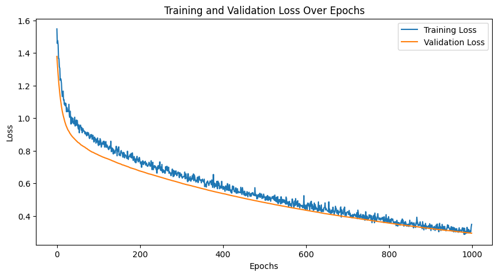

# 🧠 Breast Cancer Classification & Overfitting Analysis

A deep learning project focused on building a neural network model for breast cancer classification and analyzing overfitting behavior.

---

## 📌 Project Objective

* Develop a binary classification model using neural networks
* Analyze overfitting through training and validation metrics
* Apply regularization techniques to improve model generalization

---

## 📊 Dataset

* **Breast Cancer Dataset** (from Scikit-learn)
* **Features:** 30 numerical features
* **Target:**

  * `0` → Malignant
  * `1` → Benign

---

## ⚙️ Technologies Used

* Python
* TensorFlow / Keras
* Scikit-learn
* NumPy
* Matplotlib

---

## 🏗️ Model Architecture

* Fully Connected Neural Network (Dense layers)
* Batch Normalization
* Dropout Layers
* L2 Regularization

---

## 🛠️ Techniques Applied

* Train / Validation Split
* Feature Scaling (StandardScaler)
* Early Stopping
* Overfitting Analysis using training curves

---

## 📈 Results

* Compared training and validation performance
* Observed overfitting behavior
* Improved generalization using:

  * Dropout
  * L2 Regularization
  * Early Stopping

---

## 📷 Visualization

Model performance is evaluated using:

* Training vs Validation Loss
* Training vs Validation Accuracy


```markdown

```

---

## 🚀 How to Run

### 1. Clone the repository

```bash
git clone https://github.com/Leman2006/breast-cancer-nn-overfitting.git
cd breast-cancer-nn-overfitting
```

### 2. Install dependencies

```bash
pip install -r requirements.txt
```

### 3. Run the notebook

```bash
jupyter notebook
```

---

## 📁 Project Structure

```
breast-cancer-nn-overfitting/
│
├── notebook.ipynb
├── README.md
├── requirements.txt
└── images/
    └── training_plot.png
```

---

## 💡 Key Takeaways

* Overfitting is a critical challenge in neural networks
* Regularization techniques significantly improve generalization
* Validation metrics are essential for reliable model evaluation

---

## 🔮 Future Improvements

* Add confusion matrix and classification report
* Compare with traditional ML models (Logistic Regression, SVM)
* Perform hyperparameter tuning
* Apply cross-validation

---

## ⭐ Author

Created as part of a deep learning practice project.
